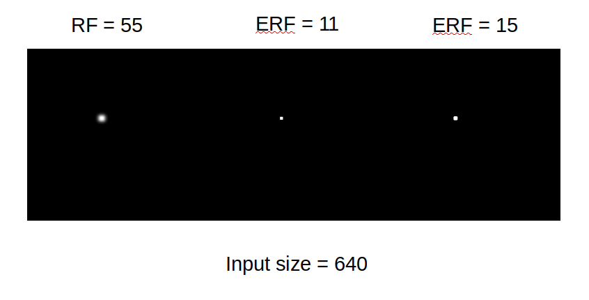
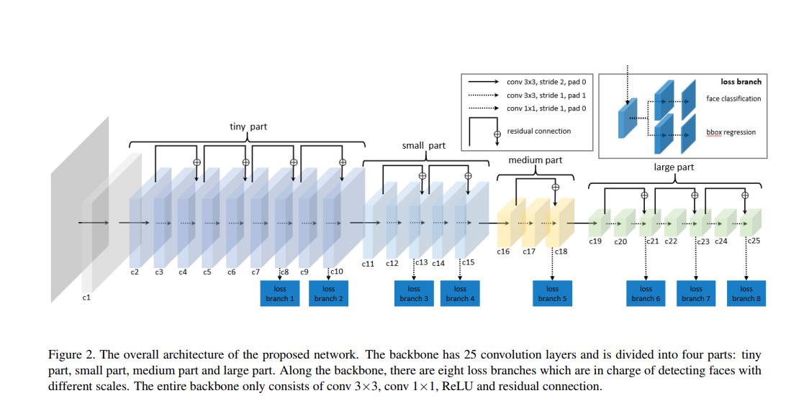

# BasketNet

This is a demo of a LFFD model for a Basketball Recognition Competition.

The demo is based on SSD and LFFD.
## Install
```[cmd]
git clone https://github.com/aoru45/LFFD-Pytorch.git
```

## Usage
Download or make your own dataset and modify the dataset.py file.
```[cmd]
python train.py
```

## rf and erf visualize:


The visulaization code is avaliable here: https://github.com/aoru45/LFFD-Pytorch/blob/master/visualize_demo.py

## Network Structure




## demo result


## Reference

SSD:https://arxiv.org/abs/1512.02325

LFFD:https://arxiv.org/pdf/1904.10633.pdf


